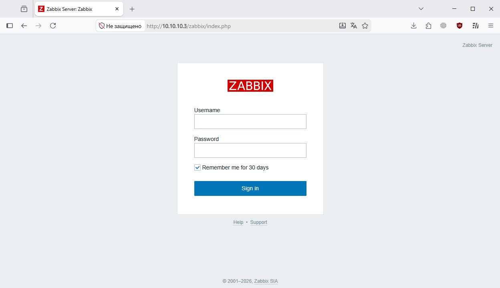
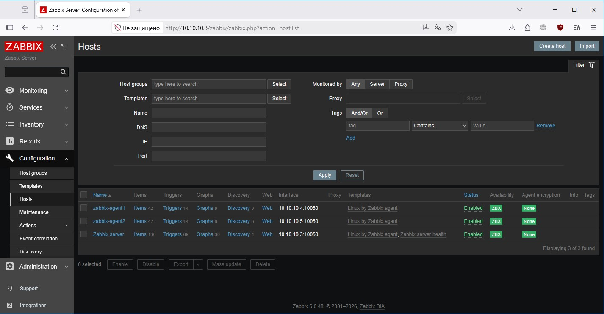
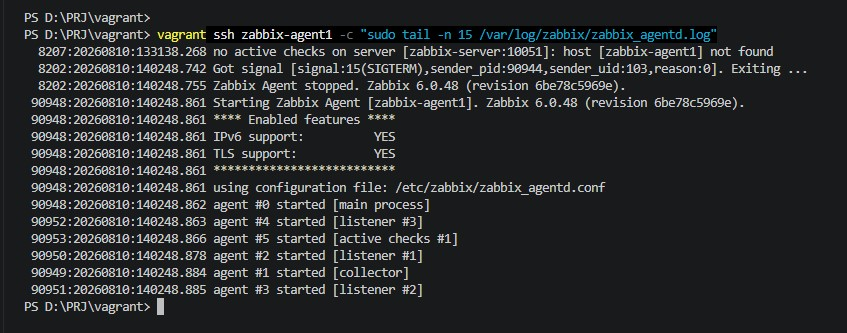
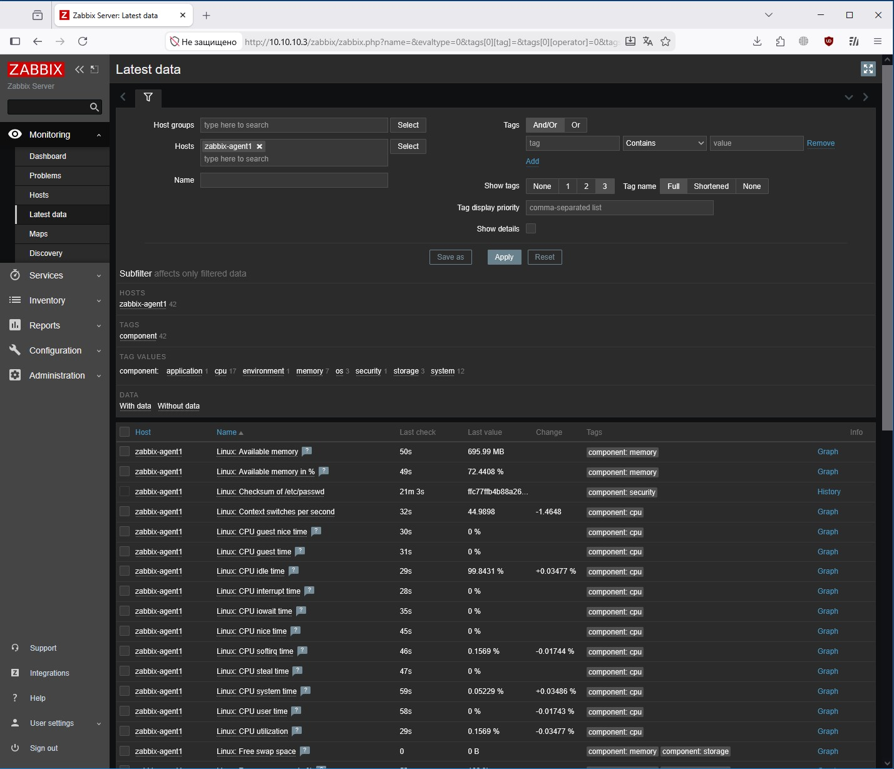

# Домашнее задание к занятию "GitLab" - `Модонов Николай`

### Задание 1
Установите Zabbix Server с веб-интерфейсом.
Процесс выполнения

1. Выполняя ДЗ, сверяйтесь с процессом отражённым в записи лекции.
2. Установите PostgreSQL. Для установки достаточна та версия, что есть в системном репозитороии Debian 11.
3. Пользуясь конфигуратором команд с официального сайта, составьте набор команд для установки последней версии Zabbix с поддержкой PostgreSQL и Apache.
4. Выполните все необходимые команды для установки Zabbix Server и Zabbix Web Server.

Требования к результатам

1. Прикрепите в файл README.md скриншот авторизации в админке.
2. Приложите в файл README.md текст использованных команд в GitHub.

Решение:
1. 
2. В самом GitHub в данном задании практически не использовались команды. Команды консоли для задания 1:
```
# Установка PostgreSQL
apt-get update
apt-get install -y postgresql

# Добавление репозитория Zabbix
wget https://repo.zabbix.com/zabbix/6.0/debian/pool/main/z/zabbix-release/zabbix-release_6.0-5+debian12_all.deb
dpkg -i zabbix-release_6.0-5+debian12_all.deb
apt-get update

# Установка Zabbix Server, веб-интерфейса и агента
apt-get install -y zabbix-server-pgsql zabbix-frontend-php zabbix-apache-conf zabbix-sql-scripts

# Настройка локали (для корректного отображения веб-интерфейса)
sudo localectl set-locale LANG=en_US.UTF-8
sudo systemctl restart apache2

# Создание пользователя и базы данных
sudo -u postgres psql -c "CREATE USER zabbix WITH PASSWORD '123456789';"
sudo -u postgres psql -c "CREATE DATABASE zabbix OWNER zabbix;"
zcat /usr/share/zabbix-sql-scripts/postgresql/server.sql.gz | sudo -u zabbix psql zabbix

# Настройка пароля БД в конфигурационном файле Zabbix Server
sed -i 's/# DBPassword=/DBPassword=123456789/g' /etc/zabbix/zabbix_server.conf

# Запуск и добавление в автозагрузку служб
systemctl restart zabbix-server apache2 zabbix-agent
systemctl enable zabbix-server apache2 zabbix-agent

```

---

### Задание 2

Установите Zabbix Agent на два хоста.
Процесс выполнения

1. Выполняя ДЗ, сверяйтесь с процессом отражённым в записи лекции.
2. Установите Zabbix Agent на 2 вирт.машины, одной из них может быть ваш Zabbix Server.
3. Добавьте Zabbix Server в список разрешенных серверов ваших Zabbix Agentов.
4. Добавьте Zabbix Agentов в раздел Configuration > Hosts вашего Zabbix Servera
5. Проверьте, что в разделе Latest Data начали появляться данные с добавленных агентов.

Требования к результатам

1. Приложите в файл README.md скриншот раздела Configuration > Hosts, где видно, что агенты подключены к серверу
2. Приложите в файл README.md скриншот лога zabbix agent, где видно, что он работает с сервером
3. Приложите в файл README.md скриншот раздела Monitoring > Latest data для обоих хостов, где видны поступающие от агентов данные.
4. Приложите в файл README.md текст использованных команд в GitHub


Решение:
1. 
2. 
3. 
4. Команды для задания 2:

```
# Установка репозитория Zabbix
wget https://repo.zabbix.com/zabbix/6.0/debian/pool/main/z/zabbix-release/zabbix-release_6.0-5+debian12_all.deb
dpkg -i zabbix-release_6.0-5+debian12_all.deb
apt-get update

# Установка Zabbix Agent
apt-get install -y zabbix-agent

# Настройка Zabbix Agent (указываем адрес сервера и имя хоста)
sed -i 's/Server=127.0.0.1/Server=10.10.10.3/g' /etc/zabbix/zabbix_agentd.conf
sed -i 's/ServerActive=127.0.0.1/ServerActive=10.10.10.3/g' /etc/zabbix/zabbix_agentd.conf
sed -i 's/Hostname=Zabbix server/Hostname=zabbix-agent1/g' /etc/zabbix/zabbix_agentd.conf

# Запуск и добавление в автозагрузку Zabbix Agent
systemctl restart zabbix-agent
systemctl enable zabbix-agent

# Команда для проверки логов агента (использовалась для диагностики и скриншота)
sudo tail -n 15 /var/log/zabbix/zabbix_agentd.log
```

