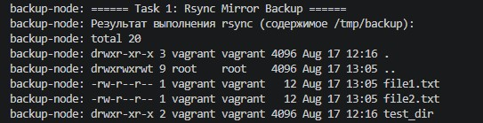
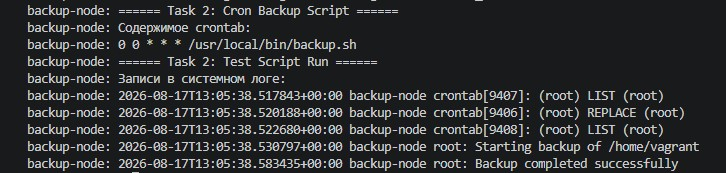

# Домашнее задание к занятию "Резервное копирование" - Модонов Николай

### Задание 1
Составьте команду rsync, которая позволяет создавать зеркальную копию домашней директории пользователя в директорию /tmp/backup
Необходимо исключить из синхронизации все директории, начинающиеся с точки (скрытые)
Необходимо сделать так, чтобы rsync подсчитывал хэш-суммы для всех файлов, даже если их время модификации и размер идентичны в источнике и приемнике.
На проверку направить скриншот с командой и результатом ее выполнения

Решение:
1. Скриншот с командой rsync и результатом выполнения (содержимое /tmp/backup)

2. Команда rsync
```bash
rsync -a -c --exclude='.*' /home/vagrant/ /tmp/backup/
```

---

### Задание 2
Написать скрипт и настроить задачу на регулярное резервное копирование домашней директории пользователя с помощью rsync и cron.
Резервная копия должна быть полностью зеркальной
Резервная копия должна создаваться раз в день, в системном логе должна появляться запись об успешном или неуспешном выполнении операции
Резервная копия размещается локально, в директории /tmp/backup
На проверку направить файл crontab и скриншот с результатом работы утилиты.

Решение:
1. Скриншот файла crontab и записей в системном логе

2. Скрипт резервного копирования /usr/local/bin/backup.sh
```bash
#!/bin/bash
logger "Starting backup of /home/vagrant"
rsync -a -c --exclude='.*' /home/vagrant/ /tmp/backup/
if [ $? -eq 0 ]; then
    logger "Backup completed successfully"
else
    logger "Backup failed"
fi
```
3. Файл cron /etc/cron.d/backup_cron
```bash
0 0 * * * root /usr/local/bin/backup.sh
```
4. Vagrantfile с описанием инфраструктуры и тестовыми данными
[Vagrantfile](src/Vagrantfile)