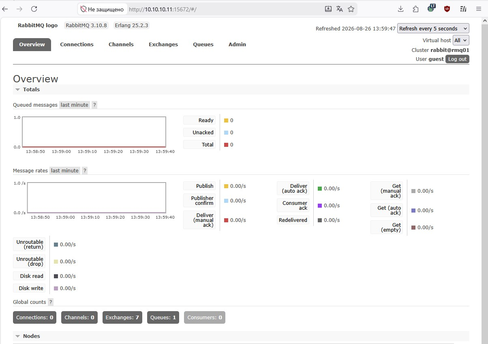
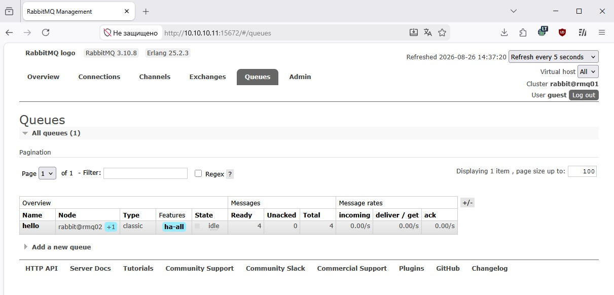
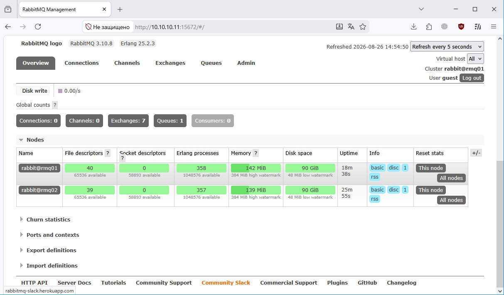
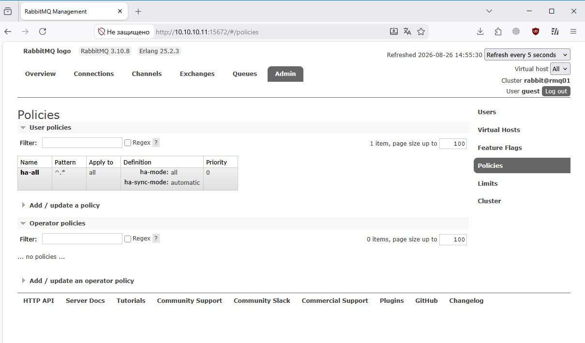
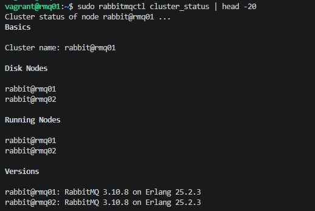
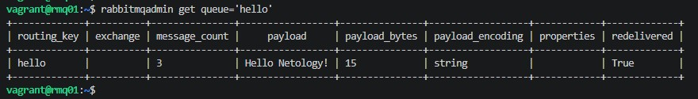
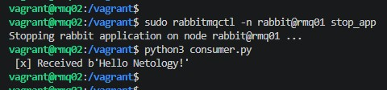

# Домашнее задание к занятию «Очереди RabbitMQ» - Модонов Николай

## Задание 1. Установка RabbitMQ

Установлен RabbitMQ, включен management-плагин. Веб-интерфейс доступен по адресу `http://10.10.10.11:15672` (логин/пароль: guest/guest).

**Скриншот статуса сервиса и management-плагина:**



**Команды для проверки:**
```bash
systemctl status rabbitmq-server --no-pager | cat
rabbitmq-plugins list -e | grep management
```

---

## Задание 2. Отправка и получение сообщений

Созданы скрипты `producer.py` и `consumer.py` на Python с использованием библиотеки Pika.  
Очередь `hello` объявлена, сообщение отправлено и успешно получено.

**Скриншот отправки и получения сообщения:**



**Команды для запуска:**
```bash
python3 producer.py rmq02 "Test message 1"
python3 consumer.py rmq02
```

---

## Задание 3. Подготовка HA кластера

Созданы две виртуальные машины (`rmq01` и `rmq02`), объединены в кластер.  
Создана политика `ha-all` с режимом `all` для всех очередей.

**Скриншот веб-интерфейса с информацией о доступных нодах кластера:**



**Скриншот веб-интерфейса с включённой политикой `ha-all`:**



**Вывод `rabbitmqctl cluster_status` на одной из нод (видны обе):**



**Вывод `rabbitmqadmin get queue='hello'` до отключения (сообщение в очереди есть):**



После этого нода `rmq01` была отключена командой:
```bash
sudo rabbitmqctl -n rabbit@rmq01 stop_app
```

Затем на ноде `rmq02` запущен `consumer.py` (с исправленным синтаксисом для новой версии Pika).  
Сообщение успешно получено, что подтверждает работу кластера после отказа одной ноды.

**Скриншот результата работы `consumer.py` после отключения `rmq01`:**



**Использованные команды:**
```bash
# Статус кластера
sudo rabbitmqctl cluster_status

# Создание политики ha-all
sudo rabbitmqctl set_policy ha-all "^.*" '{"ha-mode":"all","ha-sync-mode":"automatic"}'

# Проверка очереди до отключения (на любой ноде)
rabbitmqadmin -H localhost get queue='hello'

# Отключение ноды rmq01
sudo rabbitmqctl -n rabbit@rmq01 stop_app

# Запуск producer и consumer на rmq02 (после отключения)
cd /vagrant
python3 producer.py
python3 consumer.py
```