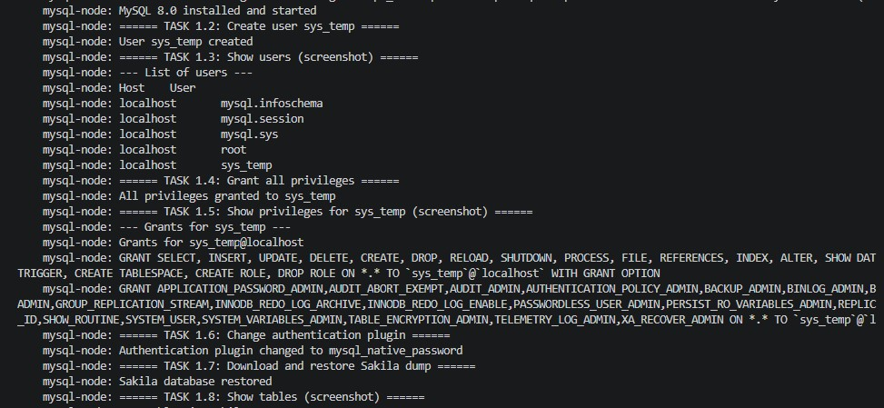
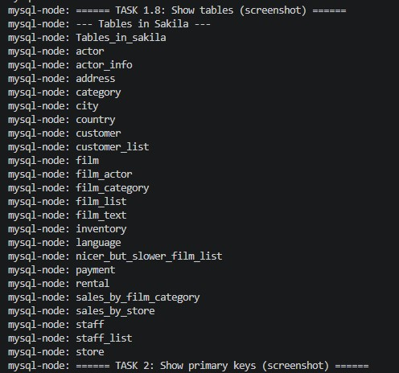
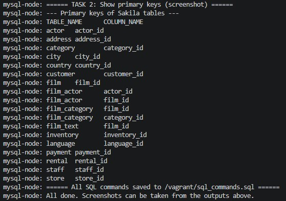

# Домашнее задание к занятию «Работа с данными (DDL/DML)» - Модонов Николай

## Задание 1

1.1. Поднят чистый инстанс MySQL 8.0+ на Vagrant (Debian 12).

1.2. Создана учётная запись `sys_temp`.

1.3. Получен список пользователей.

1.4. Пользователю `sys_temp` выданы все права.

1.5. Получен список прав для `sys_temp`.

1.6. Выполнено переподключение от имени `sys_temp` с изменением типа аутентификации на `mysql_native_password`.

1.7. Скачан и восстановлен дамп базы Sakila.



1.8. Получен список таблиц базы Sakila (скриншот):



**Простыня SQL-запросов**

```sql
-- 1.2
CREATE USER 'sys_temp'@'localhost' IDENTIFIED BY 'password';

-- 1.3
SELECT Host, User FROM mysql.user;

-- 1.4
GRANT ALL PRIVILEGES ON *.* TO 'sys_temp'@'localhost' WITH GRANT OPTION;
FLUSH PRIVILEGES;

-- 1.5
SHOW GRANTS FOR 'sys_temp'@'localhost';

-- 1.6
ALTER USER 'sys_temp'@'localhost' IDENTIFIED WITH mysql_native_password BY 'password';

-- (Подключение: mysql -u sys_temp -p)

-- 1.8
USE sakila;
SHOW TABLES;
```

---

## Задание 2

Составлена таблица с названиями таблиц базы Sakila и их первичными ключами.

**Таблица:**

```sql
Название таблицы | Название первичного ключа
-----------------|--------------------------
actor            | actor_id
address          | address_id
category         | category_id
city             | city_id
country          | country_id
customer         | customer_id
film             | film_id
film_actor       | (actor_id, film_id) – составной
film_category    | (film_id, category_id) – составной
film_text        | film_id
inventory        | inventory_id
language         | language_id
payment          | payment_id
rental           | rental_id
staff            | staff_id
store            | store_id
```

**Скриншот результата запроса на получение первичных ключей (дополнительно):**



**Использованный запрос:**

```sql
USE sakila;
SELECT TABLE_NAME, COLUMN_NAME
FROM INFORMATION_SCHEMA.KEY_COLUMN_USAGE
WHERE TABLE_SCHEMA = 'sakila' AND CONSTRAINT_NAME = 'PRIMARY'
ORDER BY TABLE_NAME, ORDINAL_POSITION;
```