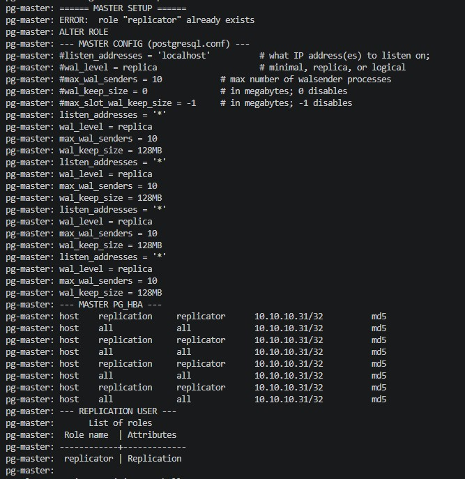
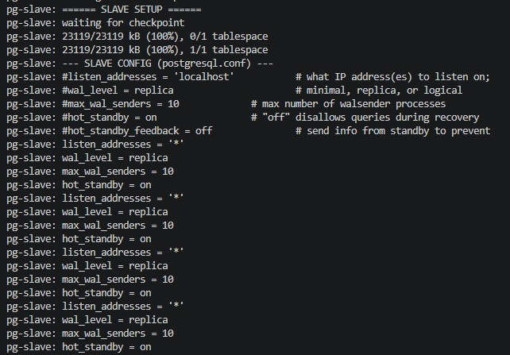
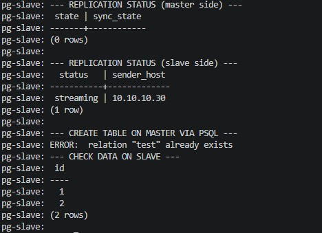

# Домашнее задание к занятию «Репликация и масштабирование. Часть 1» - Модонов Николай

## Задание 1. Различия режимов репликации master-slave и master-master

### Master-Slave (ведущий-ведомый)

- Один сервер является **master** (ведущим), на нём разрешены операции записи (INSERT, UPDATE, DELETE, CREATE и т.д.).
- Один или несколько серверов являются **slave** (ведомыми), они получают изменения от мастера и применяют их к своим копиям данных.
- Запись осуществляется только на мастер.
- Чтение может распределяться между мастером и слейвами для снижения нагрузки.
- Репликация асинхронная (по умолчанию) – слейв не гарантирует, что данные сразу применены. Можно настроить синхронную.
- При падении мастера необходимо переключение, ручное или автоматизированное, для назначения нового мастера.
- Сценарии: для высокой нагрузкой на чтение, для резервного копирования, для отказоустойчивости.

### Master-Master (двунаправленная репликация, multi-master с двумя узлами)

- Два или более сервера являются мастерами, каждый может принимать запись.
- Изменения, сделанные на одном мастере, реплицируются на другой (и наоборот).
- Требуется разрешение конфликтов – если на обоих мастерах одновременно изменить одну и ту же запись, возникнет конфликт (например, разные значения одного поля). Для этого используются специальные механизмы (auto_increment_offset/increment, детекция конфликтов, ручное разрешение).
- Сложнее в настройке и поддержке, требует более тщательного контроля за целостностью данных.
- При падении одного мастера второй продолжает работать, но восстановление после сбоя может быть сложным.
- Сценарии: для высокой нагрузкой на запись, для географической разделенности, например филиальной сети.

Выбор режима зависит от ТЗ: нагрузка, допустимость конфликтов, возможности администрирования.

---

## Задание 2. Конфигурация master-slave репликации

На двух виртуальных машинах (Debian 12) развёрнут PostgreSQL 16.  
Мастер (`pg-master`, IP 10.10.10.30) и слейв (`pg-slave`, IP 10.10.10.31).  
Репликация настроена по потоковому режиму (streaming replication).

**Скриншот конфигурации мастера (postgresql.conf, pg_hba.conf, пользователь replicator):**



**Скриншот конфигурации слейва (postgresql.conf) и статуса репликации:**



**Скриншот проверки репликации (создание таблицы на мастере, чтение на слейве):**



### Основные команды

На мастере:
```bash
# Включить репликацию
cat >> /etc/postgresql/16/main/postgresql.conf <<EOF
listen_addresses = '*'
wal_level = replica
max_wal_senders = 10
wal_keep_size = 128MB
EOF

# Разрешить доступ для слейва
cat >> /etc/postgresql/16/main/pg_hba.conf <<EOF
host    replication     replicator      10.10.10.31/32          md5
host    all             all             10.10.10.31/32          md5
EOF

# Создать пользователя репликации
CREATE USER replicator WITH REPLICATION LOGIN ENCRYPTED PASSWORD 'repl_pass';
```

На слейве:
```bash
# Остановить и очистить данные
systemctl stop postgresql
rm -rf /var/lib/postgresql/16/main/*
```