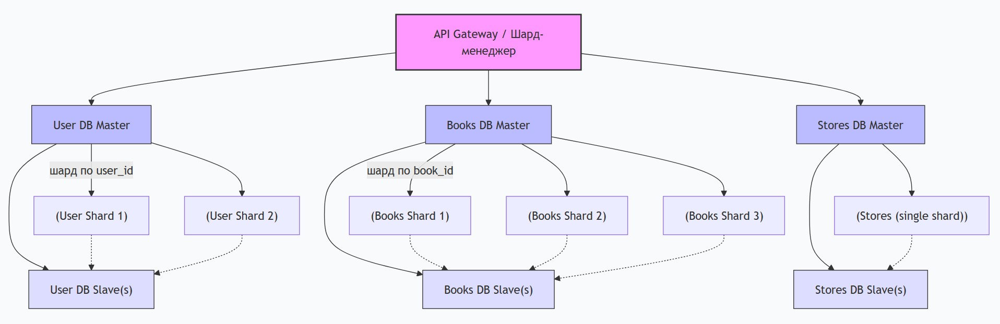

# Домашнее задание к занятию «Репликация и масштабирование. Часть 2» - Модонов Николай

## Задание 1. Преимущества методов масштабирования

### Активный master-сервер и пассивный репликационный slave-сервер

- **Отказоустойчивость:** при падении мастера можно переключиться на slave (ручное или автоматическое), что снижает время простоя.
- **Резервное копирование:** можно делать бэкапы со slave, не нагружая master.
- **Балансировка чтения:** часть запросов на чтение можно направлять на slave, разгружая master.
- **Простота настройки:** конфигурация проще, чем многомастерные схемы.

### Master-сервер и несколько slave-серверов

- **Горизонтальное масштабирование чтения:** несколько slave позволяют распределять большую нагрузку на чтение между ними.
- **Геораспределение:** slave можно размещать в разных дата-центрах для ускорения доступа для удалённых пользователей.
- **Повышенная надёжность:** наличие нескольких копий данных увеличивает защиту от потери данных.
- **Специализация slave:** разные slave могут использоваться для разных типов запросов (аналитика, отчёты, поиск), не мешая основной работе.
- **Роллинг-апдейты:** можно обновлять ПО на slave по очереди, не останавливая всю систему.

---

## Задание 2. План горизонтального и вертикального шардинга

### Исходные данные

Таблицы:
- **Пользователи** (user_id, имя, email, регистрационные данные)
- **Книги** (book_id, название, автор, жанр, цена)
- **Магазины** (store_id, название, адрес, контакты)

### Вертикальный шардинг (разделение по таблицам)

Каждая таблица выделяется в отдельную базу данных на отдельном сервере (или кластере). Это позволяет специализировать серверы под свои нагрузки (например, для таблицы книг — много поисковых запросов, для пользователей — много авторизаций).

**Схема:**
- БД 1 (Users DB) – таблица пользователей.
- БД 2 (Books DB) – таблица книг.
- БД 3 (Stores DB) – таблица магазинов.

**Связи:** 

идентификаторы (user_id, book_id, store_id) используются как внешние ключи, а сами связи (например, кто какую книгу купил) могут храниться в отдельной таблице заказов (если она есть) или в сервисном слое.

### Горизонтальный шардинг (разделение по строкам)

Для таблиц, которые могут стать очень большими (например, пользователи или книги), применяем горизонтальный шардинг по ключу. Например:

- **Пользователи** – шардируем по user_id (хэш или диапазон) на 2–3 шарда.
- **Книги** – можно шардировать по жанру или по автору (если выборка часто идёт по этим полям).
- **Магазины** – обычно таблица небольшая, горизонтальный шардинг не требуется, оставляем без шардинга или реплицируем на все шарды для быстрого доступа.

### Итоговая архитектура (пример для 3 шардов)

**Вертикальные шарды:**  
- Шард А: таблица пользователей + таблица магазинов (магазины реплицированы сюда для локальных связей).  
- Шард Б: таблица книг (горизонтально разделена по жанрам: шард Б1 – фантастика, шард Б2 – детективы, шард Б3 – классика).  
- Шард В: таблица заказов (если добавить) и связующие данные.

Однако проще и реалистичнее:

**Решение:**
1. **База данных для пользователей (User DB)** – вертикальный шард, хранит только таблицу users. При необходимости горизонтально шардируется по user_id (2 шарда, например).
2. **База данных для книг (Book DB)** – вертикальный шард, хранит books. Горизонтально шардируется по book_id (например, по диапазонам id: 1–100000, 100001–200000 и т.д.).
3. **База данных для магазинов (Store DB)** – вертикальный шард, таблица stores (небольшая, без горизонтального шардинга, но реплицируется на все шарды для быстрых JOIN).

Дополнительно создаётся сервис маршрутизации (API Gateway), который по ключу запроса определяет, в какой шард обращаться, и направляет запрос. Для операций, затрагивающих разные шарды (например, получить книги пользователя), применяется агрегация данных на уровне приложения.

### Режимы работы серверов

- **User DB Master** – принимает запись (INSERT/UPDATE), реплицируется на User DB Slave для чтения.
- **Book DB Master** – принимает запись, реплицируется на Book DB Slave (или несколько slave для поиска).
- **Store DB Master** – принимает запись, реплицируется на Store DB Slave.
- **Сервера приложений** – работают в режиме чтения/записи, но маршрутизируют запросы к нужным шардам через шард-менеджер.
- **Шард-менеджер (маршрутизатор)** – работает как балансировщик, направляет запросы по ключам.

### Блок-схема 

Каждая БД имеет свой master для записи и один или несколько slave для чтения. Взаимодействие между шардами происходит только на уровне приложения (через шард-менеджер), прямое соединение между разными типами БД не используется, чтобы избежать каскадных сбоев.

### Преимущества такого плана

- Каждая таблица обслуживается специализированным сервером, что упрощает оптимизацию.
- Горизонтальный шардинг позволяет масштабировать отдельные таблицы независимо.
- Репликация обеспечивает отказоустойчивость и распределение нагрузки на чтение.
- При увеличении нагрузки можно добавлять новые шарды (горизонтально) или новые slave.

Таким образом, система построена на сочетании вертикального (по таблицам) и горизонтального (по ключам) шардинга с использованием репликации для обеспечения надёжности.