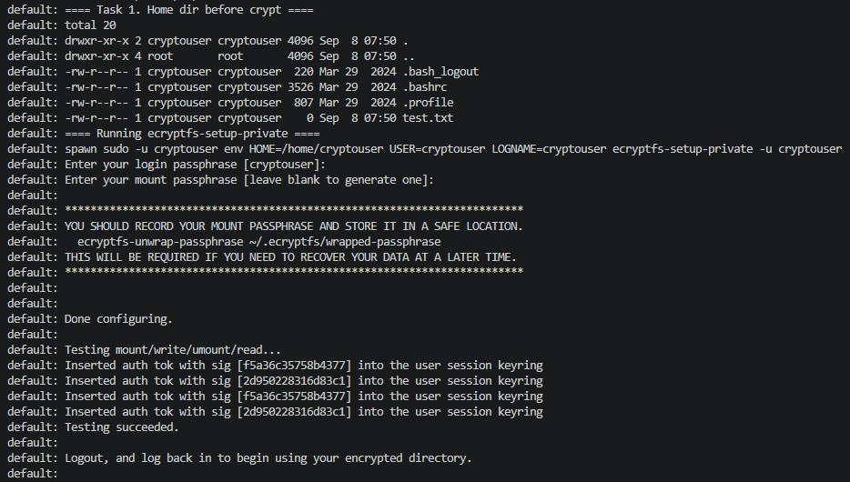
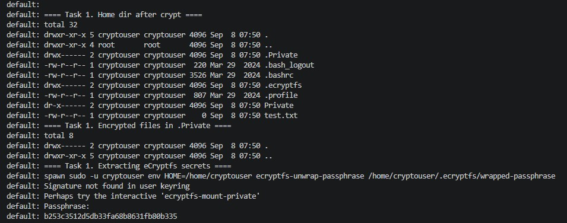
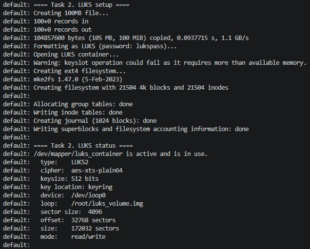
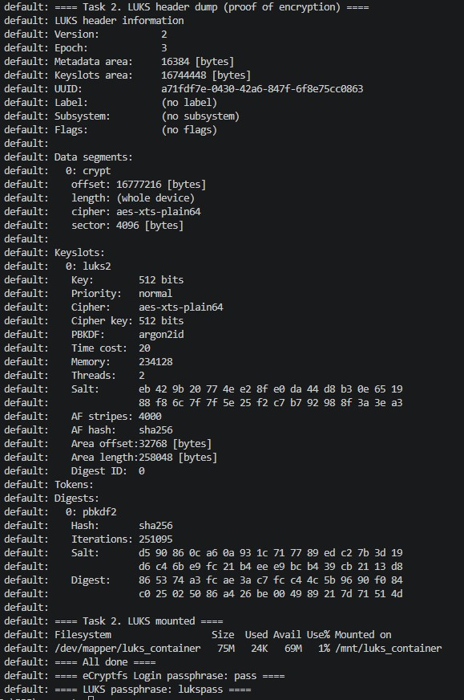

# Домашнее задание к занятию «Защита хоста» - Модонов Николай

## Задание 1. Шифрование домашнего каталога eCryptfs

Установлен пакет ecryptfs-utils, загружен модуль ядра ecryptfs. Создан пользователь cryptouser с паролем `pass`. Выполнена инициализация шифрования домашнего каталога через `ecryptfs-setup-private` с автоматическим вводом паролей (логин-пароль `pass`, mount-пароль сгенерирован автоматически). После настройки в домашнем каталоге появились папки `.Private` (с зашифрованными файлами), `.ecryptfs` (с ключами) и `Private` (точка монтирования расшифрованных данных). Получена парольная фраза для восстановления: `b253c3512d5db33fa68b8631fb80b335`.

**Скриншоты:**

---

## Задание 2. Шифрование раздела LUKS

Установлен пакет cryptsetup. Создан файл-образ `/root/luks_volume.img` размером 100 МБ, который использован как loop-устройство. Раздел отформатирован в LUKS2 с паролем `lukspass`, открыт как `/dev/mapper/luks_container`, на нём создана файловая система ext4 и примонтирован в `/mnt/luks_container`. Статус устройства, заголовок LUKS (доказательство шифрования) и точка монтирования показаны на скриншотах.

**Скриншоты:**

---

Все задания выполнены с использованием Vagrant ([файл Vagrant](src/Vagrantfile)).