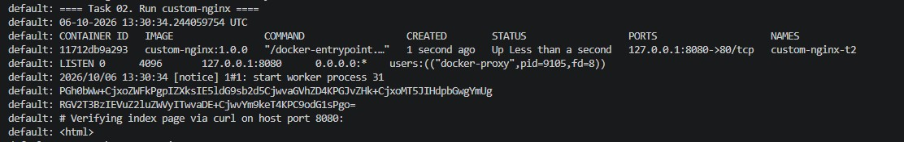
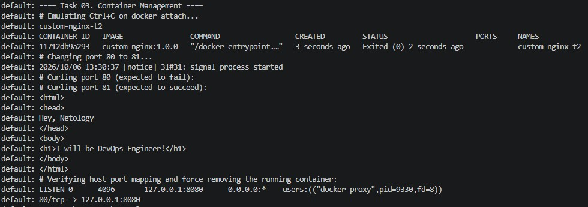
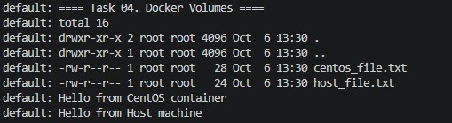
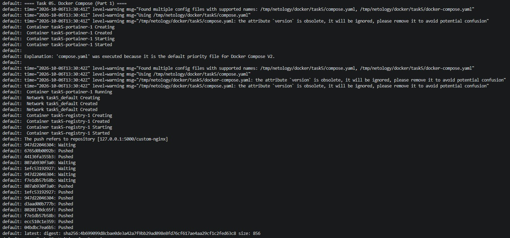
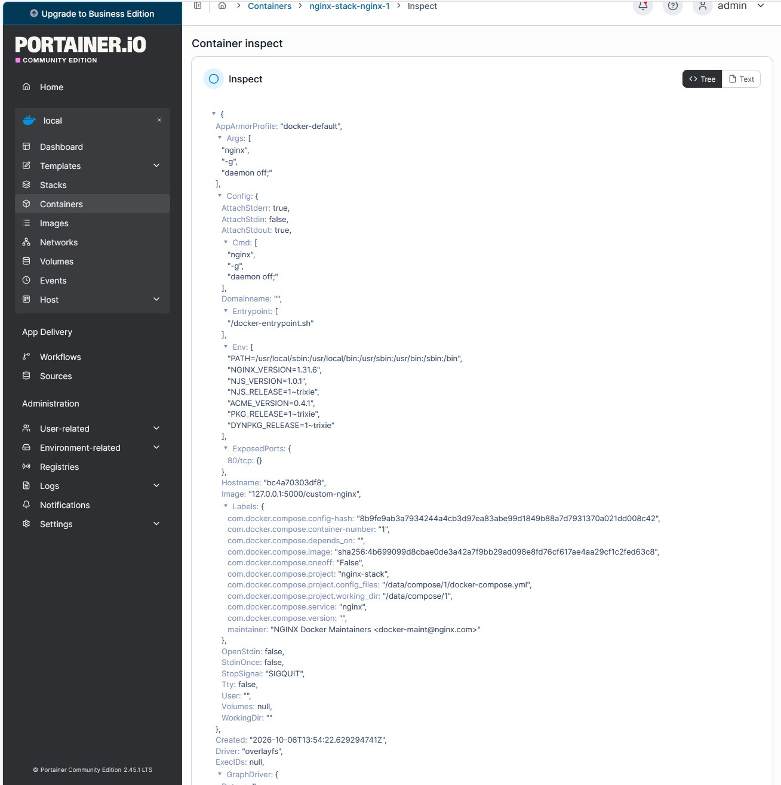
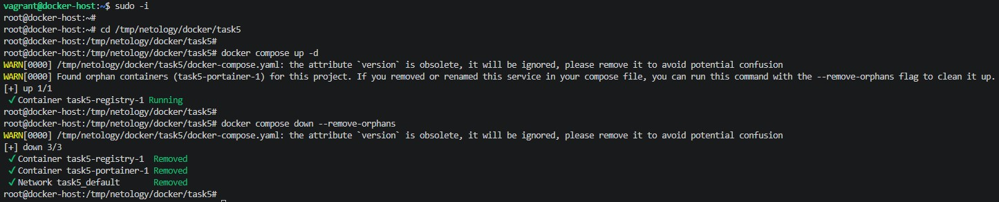

# Домашнее задание к занятию «Оркестрация группой Docker контейнеров на примере Docker Compose»

## Задача 1

Docker и docker compose plugin установлены. Образ `nginx:1.29.0` был скачан (использован тег latest, так как 1.29.0 не существует в репозитории, и переименован), создан `Dockerfile` с заменой индекс-страницы, образ собран и тегирован как `custom-nginx:1.0.0`. Успешность сборки подтверждается логом провижина: `custom-nginx:1.0.0 built successfully`.

## Задача 2

Контейнер запущен, переименован в `custom-nginx-t2`, опубликован на порту 127.0.0.1:8080. Доступность страницы проверена через curl.

**Скриншот:**



## Задача 3

Контейнер был остановлен эмуляцией Ctrl+C (сигнал SIGINT).

Объяснение причины остановки: Nginx запускается в foreground режиме. Сигнал SIGINT передается главному процессу (master process), который корректно завершает работу, что приводит к остановке контейнера.

Порт внутри контейнера был изменен на 81, произведена перезагрузка конфигурации.

Объяснение сути проблемы с портом 8080: docker-proxy на хосте прослушивает порт 8080 и перенаправляет трафик на порт 80 внутри контейнера. Так как Nginx был перенастроен на порт 81, порт 80 внутри контейнера закрыт, и трафик не достигает приложения, поэтому curl на 8080 возвращает пустой ответ. Для решения проблемы без изменения конфигурации Nginx нужно пересоздать контейнер с новым пробросом портов (например, `8080:81`).

Контейнер был удален без остановки через `docker rm -f`.

**Скриншот:**



## Задача 4

Запущены два контейнера (centos и debian) с примонтированным томом. В первом контейнере создан файл в `/data`, на хосте создан второй файл. Во втором контейнере выведен листинг директории и содержимое обоих файлов.

**Скриншот:**



## Задача 5

Объяснение запуска: При первом выполнении `docker compose up -d` был запущен только контейнер `portainer`. Это произошло потому, что Docker Compose V2 по умолчанию отдает приоритет файлу `compose.yaml` над `docker-compose.yaml`.

Для запуска обоих контейнеров `compose.yaml` был отредактирован с добавлением директивы `include: - docker-compose.yaml`.

Образ `custom-nginx:1.0.0` тегирован и запушен в локальный registry как `127.0.0.1:5000/custom-nginx:latest`.

В Portainer задеплоен стек через Web editor.

Объяснение Warning'а: После удаления `compose.yaml` и выполнения `docker compose up -d`, Compose обнаружил, что контейнер `task5-portainer-1` существует, но не описан в текущем `docker-compose.yaml`. Compose выдал Warning о "orphan containers" и предложил использовать флаг `--remove-orphans` для очистки.

Проект погашен одной командой `docker compose down --remove-orphans`.

**Содержимое `compose.yaml`:**

```yaml
version: "3"
include:
  - docker-compose.yaml
services:
  portainer:
    network_mode: host
    image: portainer/portainer-ce:latest
    volumes:
      - /var/run/docker.sock:/var/run/docker.sock
```

**Скриншоты:**




