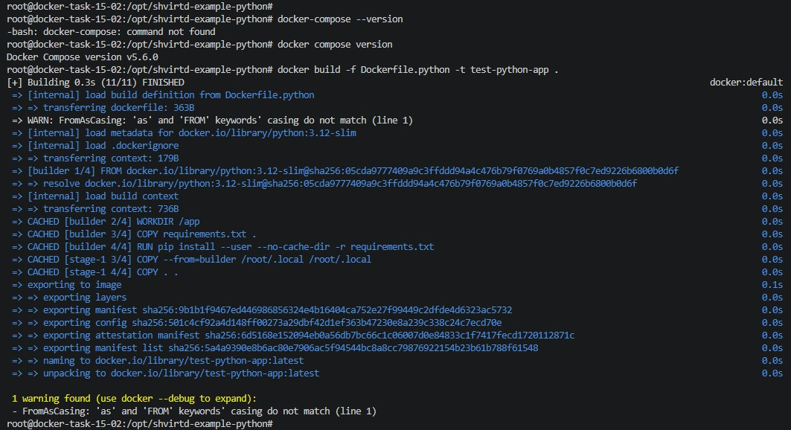
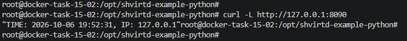
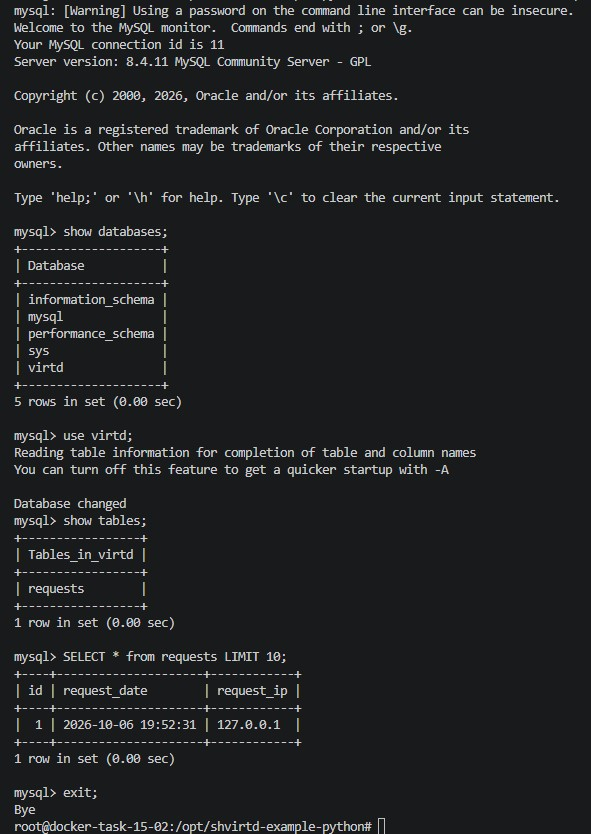
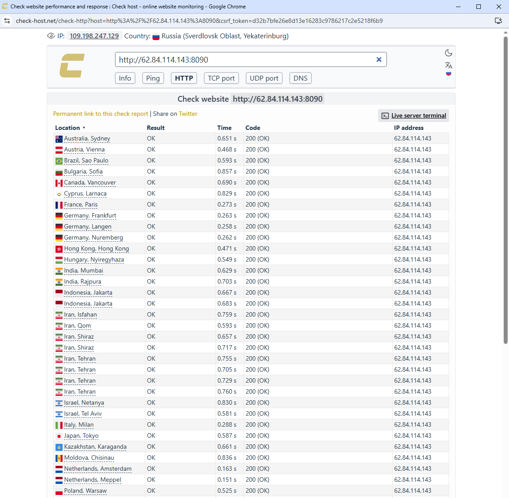
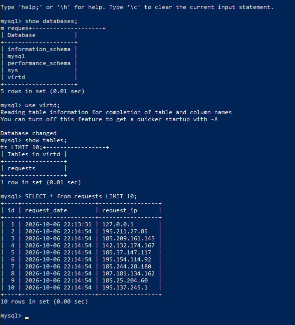
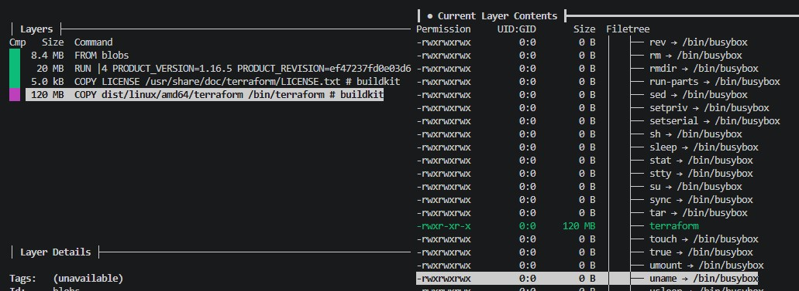
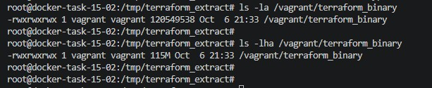

# Домашнее задание к занятию 5. «Практическое применение Docker»

## Задача 0

Убедились, что `docker-compose` (через тире) не установлен, а `docker compose` (через пробел) версии v2.x.x успешно работает.

**Скриншот:**

## Задача 1

Сделан fork репозитория `shvirtd-example-python`. Создан `Dockerfile.python` с multistage сборкой (на базе `python:3.12-slim`). Создан `.dockerignore` и `.gitignore`. Сборка образа успешно протестирована локально.

**Ссылка на fork-репозиторий:** https://github.com/NikolayModonov/shvirtd-example-python

**Скриншот:**

## Задача 3

Создан файл `compose.yaml` с директивой `include: proxy.yaml`. Описаны сервисы `web` (сборка из `Dockerfile.python`, IP 172.20.0.5) и `db` (`mysql:8`, IP 172.20.0.10) в сети `backend`. Переменные передаются через `.env` файл. Проект запущен локально. Команда `curl -L http://127.0.0.1:8090` возвращает время и IP-адрес. Выполнен SQL-запрос к БД.

**Скриншоты:**

**Содержимое `compose.yaml`:**

+++yaml
include:
  - proxy.yaml

services:
  web:
    build:
      context: .
      dockerfile: Dockerfile.python
    restart: always
    networks:
      backend:
        ipv4_address: 172.20.0.5
    environment:
      - DB_HOST=db
      - DB_USER=${MYSQL_USER}
      - DB_PASSWORD=${MYSQL_PASSWORD}
      - DB_NAME=${MYSQL_DATABASE}

  db:
    image: mysql:8
    restart: always
    networks:
      backend:
        ipv4_address: 172.20.0.10
    environment:
      - MYSQL_ROOT_PASSWORD=${MYSQL_ROOT_PASSWORD}
      - MYSQL_DATABASE=${MYSQL_DATABASE}
      - MYSQL_USER=${MYSQL_USER}
      - MYSQL_PASSWORD=${MYSQL_PASSWORD}
    volumes:
      - db_data:/var/lib/mysql

volumes:
  db_data:
+++

## Задача 4

Создана ВМ в Yandex Cloud (2 vCPU 20%, 2 ГБ RAM, Debian 12). На ВМ установлен Docker. Написан bash-скрипт `deploy.sh`, который клонирует fork-репозиторий в `/opt` и запускает проект через `docker compose up -d --build`. Проведена успешная проверка доступности сервиса извне через сайт `check-host.net`. SQL-запрос повторен на сервере.

**Скриншоты:**

## Задача 6

Скачан образ `hashicorp/terraform:latest`. Для исследования слоев использована утилита `dive`. Найден слой, содержащий файл `/bin/terraform`. Бинарный файл извлечен на локальную машину с помощью `docker save` и `tar`.

**Скриншоты:**

